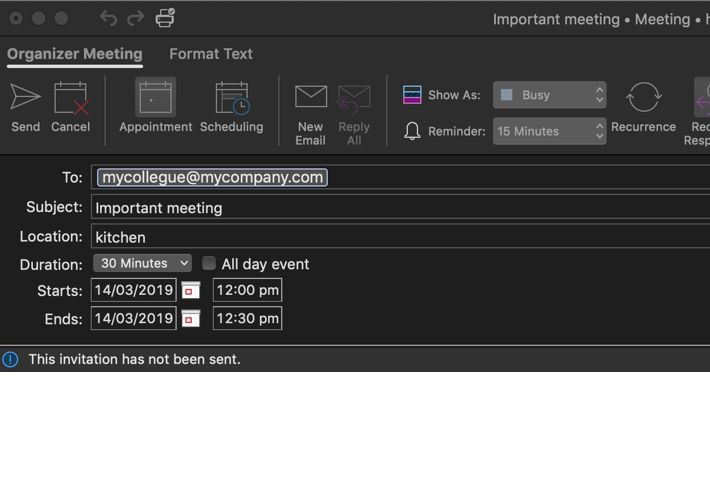
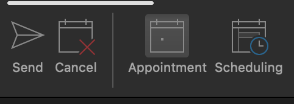
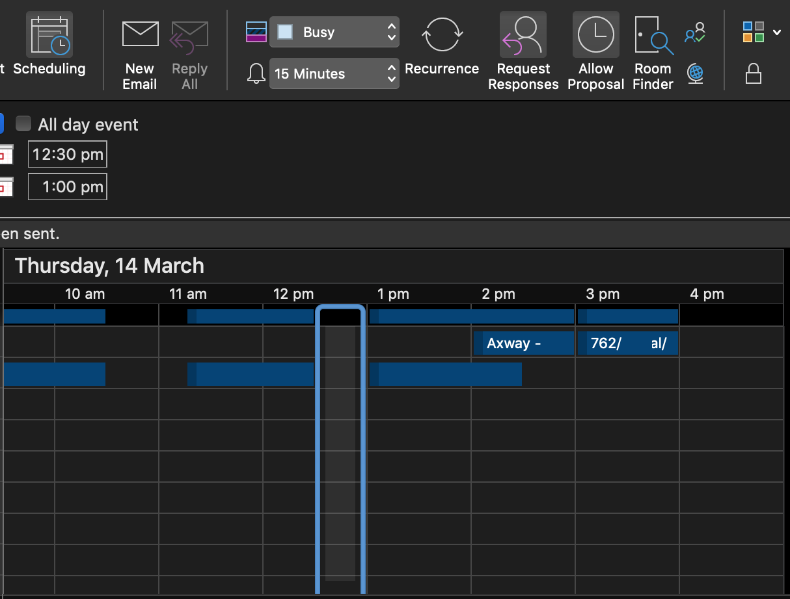

# meetings
<h1>Oops you had one job</h1>

You had one job, schedule a meeting and it looks like you stuffed it up!

You have booked a meeting, on a time when somebody already scheduled a meeting.  A commonly made mistake, which can be easily avoided.

This page is for all managers, account reps, and professionals who are likely paid over 100k but have lost the skills to book meetings with their colleagues (and it used to be so easy).  Please have a read below on how you use the outlook scheduler function. If you have anything to add, feel free to fork!

So here we go! Lesson 1: how do I book a meeting??

To start, the below is the standard screen you are using to book your meetings:
 

But wait, there is another button!
 

It is called <h2>scheduling!</h2> This miracle button can save many people a lot of time. Unfortunately the wonder minds of Microsoft haven’t fully figured out how to make this work outside your company (unless you are lucky) but it definitely works for the people within your company. Surprise it shows when they are available for a meeting!!!!

Now for that monthly pay check you are getting, people are actually expecting you to pick a meeting time when everyone is available. Mail is outdated, some of us really don’t like it, so sending invites to people on times when they are not available, annoys us!
 

Look for the blank spots they are free, if somebody has a coloured block, it means they might have something else on! (please note purple is out of office (yes people let people know when they are away, it’s amazing! – blue is generally busy, and light blue is tentative) (or it might be a non committing colleague who doesn’t want to let you know if he is going to attend a meeting, this also annoys the crap out of us, having to dial into a meeting to find out who is going to join, this will be a new blog)

So your mission, if you choose to accept it, re-send the meeting invite you tried to send and look for a time when everyone you want in this meeting is available.

Now, for the excuses why someones schedule might not be up to date, and you can't use the schedulign function:
-	My outlook calendar is not up to date for my availability. (as in, I have “business meetings” which I don’t put in my business outlook) - Sorry, during business time you got paid to do a job, if you have a meeting, just put it in your calendar.

the next blogs will be about people not accepting meeting invites 
